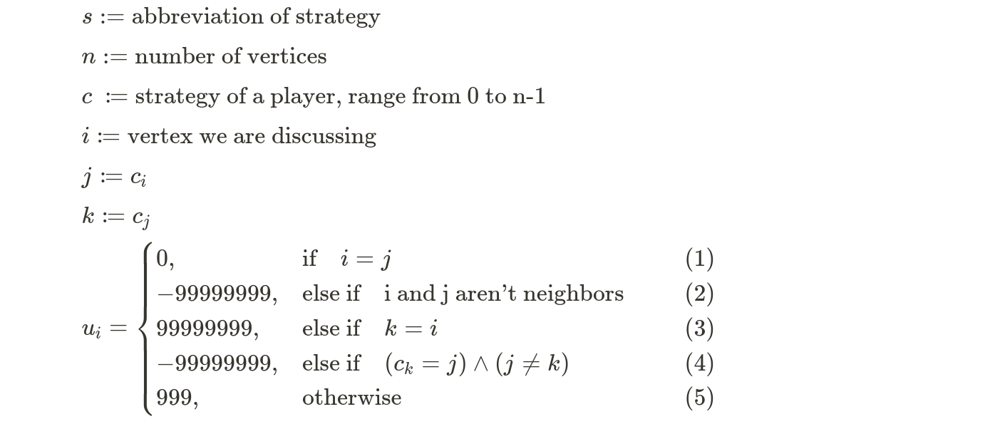
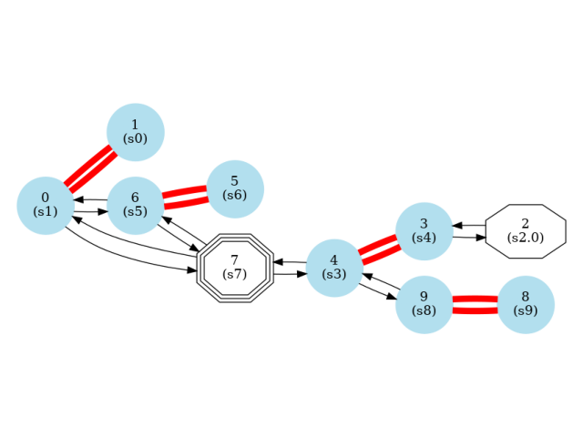
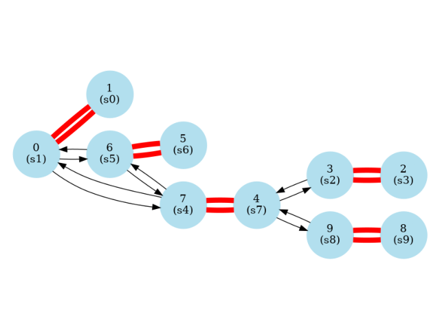
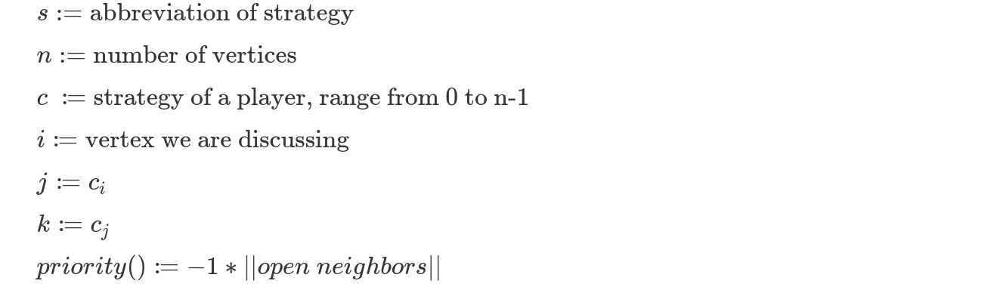
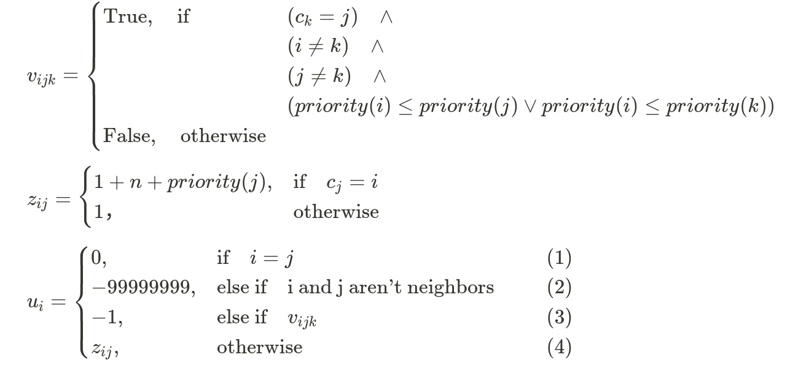
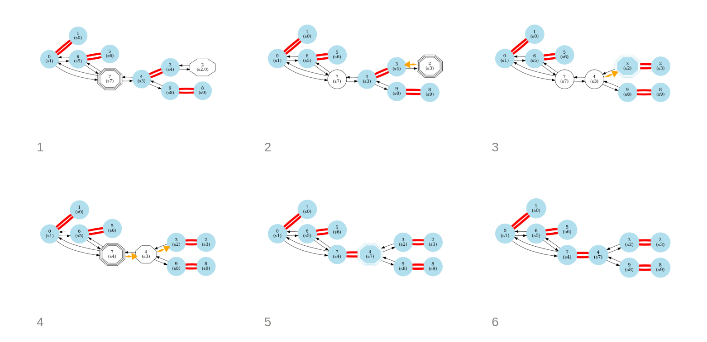
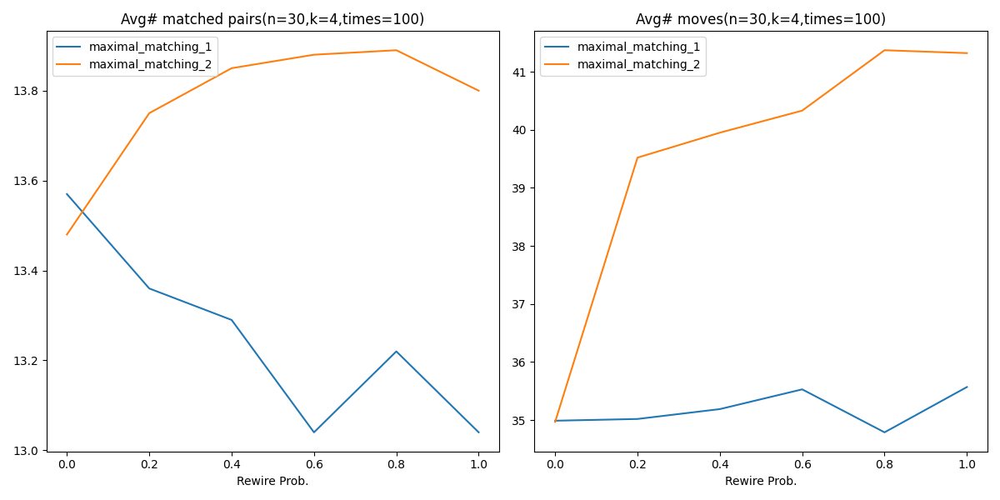
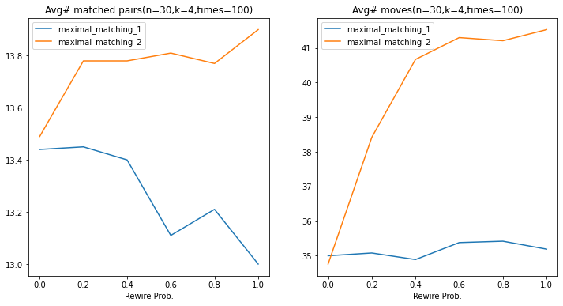

# Maximal Matching

Keywords: Maximal Matching, Game Theory

## Introduction

In this work, game-theoretical approaches are used to help us design a distributed algorithm that can solve graph problems. Two utility functions are created to make this graph game reach a Nash equilibrium and derive a maximal matching.

## Outline

- [Usage](#Usage)
    - [Install](#Install)
    - [How to use?](#How-to-Use)
- [Methods](#Methods)
    - [u1 - Without Priority](#u1---Without-Priority)
    - [u2 - With Priority](#u2--With-Priority)
- [Simulation and Results](#Simulation-and-Results)
- [Reference](#Reference)

## Usage

###  Install
```shell script
sudo apt install graphviz-python
pip3 install -r requirements.txt
```

### How to Use

> See the instruction in main.ipynb

## Methods

Two utility functions are designed. Let's call them ***u1*** and ***u2***.

Simply speaking, their major difference is whether account for **priority**, which is a heuristic to maximize the total number of matched pairs.

- u1: without priority
- u2: with priority

### u1 - Without Priority



```text
👉 Explanation:
(1) i's strategy == "i" itself ⇒ point to itself ⇒ means null here ⇒ not good not bad
(2) not an open neighbor ⇒ must not match together ⇒ bad payoff
(3) be a matching ⇒ good payoff
(4) connect to an existing matched pair ⇒ violate the rule ⇒  bad payoff
(5) accepted ⇒ a little payoff
```

By this design, the game will converge to a Nash equilibrium and form a maximal matching.

### u2 - With Priority

#### How can we increase the number of matched pairs?

Take into consideration of the following case.




- Red lines: matching
- Black lines: edges connecting adjacent vertices
- Light-blue nodes: vertices already in a matching
- Orange arrows: indicate the desire a vertex to connect a neighbor but not a matching
- You can ignore the shape here

In this graph, the number of matched pairs is 4. Are there any methods to maximize it?



Yes, by connecting this way, we get 5 matched pairs, more than the original one.

After observing the graph, you may find the tip to derive more matched pairs is to match from those vertices which have **less neighbors**. That is, we can assign priority based on the number of a vertex's open neighbors.

#### How do I design the utility function in the concept of priority?





```text
👉 Explanation:
(1) i's strategy == "i" itself ⇒ point to itself ⇒ means null here ⇒ not good not bad
(2) not an open neighbor ⇒ must not match together ⇒ bad payoff
(3) connect to an existing matched pair and you don't have a higher priority than both the vertices in that pair ⇒ you shouldn't connect ⇒  bad payoff
(4) otherwise ⇒ this design make a vertex tend to connect a vertex with higher priority to get a higher payoff
```

#### An example result of using this utility function



- Octagon means it has another strategy that can make the vertex get higher utility.
- Triple octagon means it's the vertex chosen to switch to the other strategy.

## Simulation and Results

Settings:

- number of vertices = 30
- k-nearest = 4
- rewire probability: 0.0~1.0 with step 0.2
- tested utility functions: u1 & u2 (u2 uses the concept of priority)

The simulation is run twice. The below images are the results.





From the results, we can see using the concept of priority improves the number of matched pairs while increasing the move counts. In conclusion, which utility function to adopt depends on what the application needs.

## Reference
https://en.wikipedia.org/wiki/Matching_(graph_theory)
