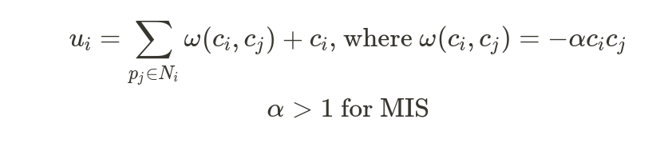
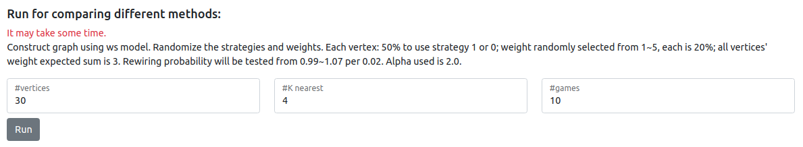
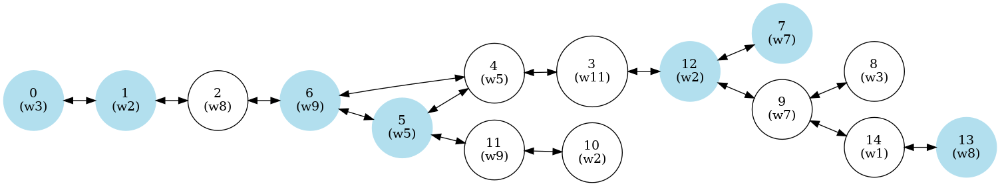

# Maximal Matching

Revised from MIS
-------------------------------------


We analyze by game-theoretical method.
Imagine every vertex is a player in a game. Each player select a strategy with highest payoff.
There are two strategies in total:

- Strategy 1 = the vertex is in the independent set.
- Strategy 2 = the vertex is NOT in the independent set.

By designing useful utility function, we make the graph find the maximal independent set itself.
We adopt this utility function[1]: 


Keywords: Maximal Independent Set (MIS), Game Theory, Distributed System

## Outline

- [Install](#Install)
- [How to Run UI](#How-to-Run-UI)
- [How to Use UI](#How-to-Use-UI) 
    - [Create a graph](#Create-a-graph)
    - [Check if the graph is an independent set](#Check-if-the-graph-is-an-independent-set)
    - [Run a move](#Run-a-move)
    - [Simulate](#Simulate)
    - [Programming Languages & Framework](#Programming-Languages-&-Framework)
    - [Plot](#Plot)
- [Programming Languages & Framework](#Programming-Languages-&-Framework)
- [Notes](#Notes)
- [Todos](#Todos)
- [Reference](#Reference)

## Usage

###  Install
```shell script
sudo apt install graphviz-python
pip3 install -r requirements.txt
```


### How to Use
#### Create a graph

#### Check if the graph is a maximal matching

#### Run a move

Find all vertices which has at least one other strategy that bring the vertex more utility. Randomly select one of them to switch to the better strategy. It'll remain unchanged if all vertices reach a Nash equilibrium.
 
- Before running a move, please create a graph first.
- Created graph is showed on top of the webpage.
- Octagon means it has other strategy which can make the vertex get higher utility.
- Triple octagon means it's the vertex chosen to switch to the other strategy.


#### Simulate

By providing n, k, rewiring probability, and some options, the system will simulate for you and showed on top of the webpage.
It may take lots of time to simulate. The result will be showed in the image area after finishing simulating.  

In each test, 3 line graphs will be displayed:

1. Average size of MIS (at left)
2. Average weight sum of MIS (at center)
3. Average number of moves of MIS (at right)

Each graph contains three plotted line:

1. Not using priority (blue)
2. Priority function 1 (orange)
3. Priority function 2 (green)



#### Plot

The created image and simulation result will be displayed at the top. You can plot custom graph by create it first and you will see it at the top of the webpage.


## Programming Languages & Framework

This project are writen by:
- Python3
- Backend: Flask
- Frontend: JavaScript/CSS/HTML5/JQuery/Bootstrap

### Notes

-  If you encounter `graphviz.backend.ExecutableNotFound: failed`, check if you install graphviz successfully and ensure its executable is in the PATH.

### Todos

- [ ] Fix graphviz excusable-not-found problem or find other solution to plot. Make this project can display on Heroku.
- [ ] Add a blog article which describe some research.

### Reference
1. L.-H. Yen, J.-Y. Huang, and V. Turau, “Designing self-stabilizing systems using game theory,” ACM Trans. on Autonomous and Adaptive Systems, 11(3), Sept. 2016.
2. Wikipedia: [Watts–Strogatz model](https://en.wikipedia.org/wiki/Watts%E2%80%93Strogatz_model)
